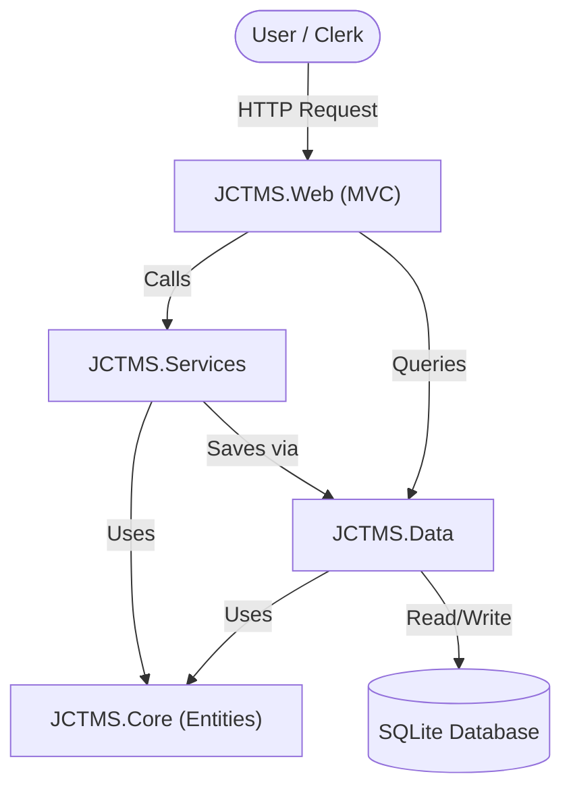
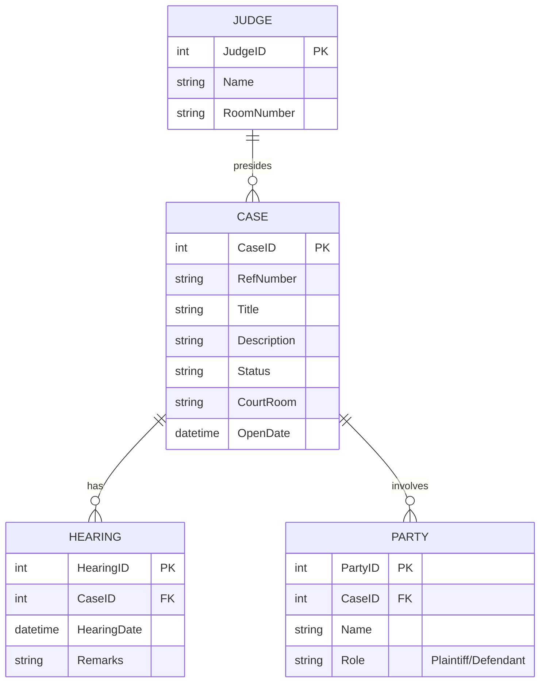
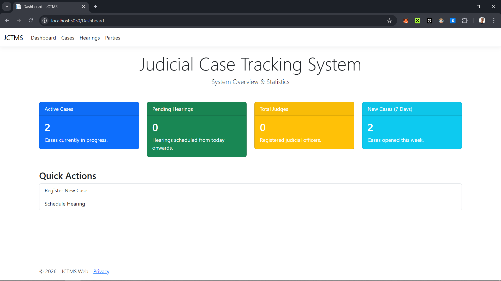

# Judicial Case Tracking & Management System (JCTMS)

> **"Lalit" Court System** - *Where Justice is Beautiful (eventually)*


## Project Overview

**JCTMS** is a comprehensive **Visual Programming Lab** project designed to modernize the workflow of judicial courts. Built with **ASP.NET Core MVC**, it provides a digital platform for judges, clerks, and lawyers to track cases from initiation to verdict.

The system emphasizes a clear separation of concerns, robust data management, and user-friendly interfaces, all while acknowledging the "ground realities" of the legal system with a touch of humor.

---

## Key Features

*   **Interactive Dashboard**: Real-time overview of Active Cases, Pending Hearings, and total Case load.
*   **Case Management**:
    *   Create new cases with **Auto-Generated Reference Numbers** (e.g., `2024-45-001`).
    *   Track case status (Reported, Started, Ready, No Action).
    *   Assign Court Rooms and Judges.
*   **Hearing Scheduler**: Schedule hearings for specific cases, add remarks, and track upcoming sessions.
*   **Party Management**: Manage Plaintiffs and Defendants linked to specific cases (One-to-Many relationship).
*   **Data Persistence**: Uses **SQLite** for reliable, zero-configuration local data storage (`jctms.db`), ensuring data survives application restarts.

---

## Architecture & Design

The solution follows a **N-Tier Architecture** to ensure maintainability and separation of logic.

### System Flow


### Database Schema (ERD)


---

## Project Structure

| Project | Type | Responsibility |
| :--- | :--- | :--- |
| **JCTMS.Web** | ASP.NET Core MVC | The UI layer containing Controllers, Views (Razor), and `wwwroot` assets. |
| **JCTMS.Services** | Class Library | Business logic layer (e.g., ID Generation logic). |
| **JCTMS.Data** | Class Library | Data Access Layer containing `AppDbContext` and Generic `Repository<T>`. |
| **JCTMS.Core** | Class Library | POCA Entities (`Case`, `Party`, etc.) and Interfaces. |

---

## Getting Started

### Prerequisites
*   [.NET 10.0 SDK](https://dotnet.microsoft.com/download) (or latest supported version)
*   VS Code or Visual Studio 2022

### Installation & Run

1.  **Clone the Repository** (or download source):
    ```bash
    git clone [https://github.com/yourusername/jctms.git](https://github.com/adeeb-ctrl/Judicial-Case-Tracking-Management-System-JCTMS-.git)
    cd Judicial-Case-Tracking-Management-System-JCTMS-
    ```

2.  **Navigate to Web Project**:
    ```bash
    cd JCTMS.Web
    ```

3.  **Run the Application**:
    ```bash
    dotnet run
    ```
    *The system will automatically create the `jctms.db` database and apply all tables on the first run.*

4.  **Access in Browser**:
    Open **http://localhost:5000** (or the port displayed in your terminal).

---

## Screenshots

### Home Page
*"Insaaf Delayed is Insaaf Denied"* - A humorous take on the reality of the legal system.


### Dashboard Stats
Quick view of how many cases are currently active vs. closed.



---

## Contributing
1.  Fork the Project
2.  Create your Feature Branch (`git checkout -b feature/NewFeature`)
3.  Commit your Changes (`git commit -m 'Add some NewFeature'`)
4.  Push to the Branch (`git push origin feature/NewFeature`)
5.  Open a Pull Request

---

*Verified & Testing on Windows 11 / .NET 10 environment.*
